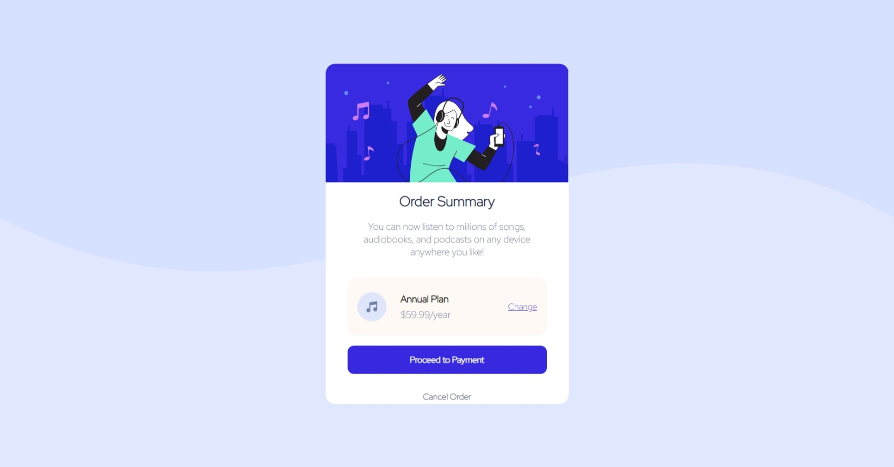

# Frontend Mentor - Order summary card solution

This is a solution to the [Order summary card challenge on Frontend Mentor](https://www.frontendmentor.io/challenges/order-summary-component-QlPmajDUj). Frontend Mentor challenges help you improve your coding skills by building realistic projects. 

## Table of contents

- [Overview](#overview)
  - [The challenge](#the-challenge)
  - [Screenshot](#screenshot)
  - [Links](#links)
- [My process](#my-process)
  - [Built with](#built-with)
  - [What I learned](#what-i-learned)
  - [Continued development](#continued-development)
  
## Overview

### The challenge

Users should be able to:

- See hover states for interactive elements

### Screenshot

### Links

- Solution URL: [Add solution URL here](https://your-solution-url.com)
- Live Site URL: [Add live site URL here](https://your-live-site-url.com)

## My process

### Built with

- Semantic HTML5 markup
- CSS custom properties
- Flexbox
- CSS Grid

### What I learned

During this challenge I first time applied my HTML and CSS skills in a porject. This project allowed me to apply stuff learned from the various tutorials I've been watching for a while. Also I learned about use of variable and media property in stylesheet along with basics like when why at times rem is better than em unit, use of before after property and such. Considering this was my first project and even though it was a beginner level challenege it took me time to complete this one I am really hoping the required amount of time would decrease in future challenges. I wish to adopt JS along the way of completing these challeneges. 

### Continued development

I am still not comfortable with use of different units in CSS. The presence of multiple units can be a bit overwhelming but I am really hoping I get to master these as I go ahead in the challenge pathway. 
